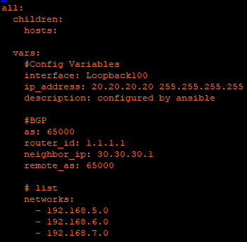
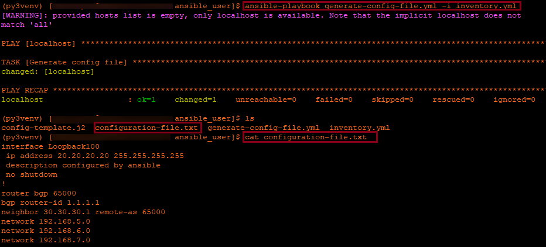

# Generate configuration file using ansible

Generate configuration file by using ansible.

**NOTE**: This script is functional in any UNIX system such macOS, Ubuntu etc. Windows OS has not been test it

# Pre-Requisites
You must have Python3(version 3.6.8 or higher), pip3 and Ansible installed(version 2.9.13 or higher). Once is done, clone this repository

# Install ansible dependencies

1. On WSL ubuntu or Linux server (normally to reach device you will first log into a linux server and then jump to the device) copy the .ini and .yml files
2. The inventory.yml file include the variables needed for the Jijan template, change those variables according to your jijan template.
3. This can be use either for xe or xr. The jinja file need to be adpat according to the platforms commands you need

# Running the script
Use the next command to run the playbook:

`ansible-playbook generate-config-file.yml -i inventory.yml`

Try this on the next sandbox [IOS XE on CSR Latest Code with ZTP functionality](https://devnetsandbox.cisco.com/RM/Diagram/Index/f2e2c0ad-844f-4a73-8085-00b5b28347a1?diagramType=Topology) execute the steps and add the variables according to the lab. 

You may also use the always-on lab for a rapid test. Please enter the [Always-on folder](https://wwwin-github.cisco.com/rdesachy/generate-config-file/tree/master/Always-on-xe)
execute the steps above and just run the files the variables are all set up.